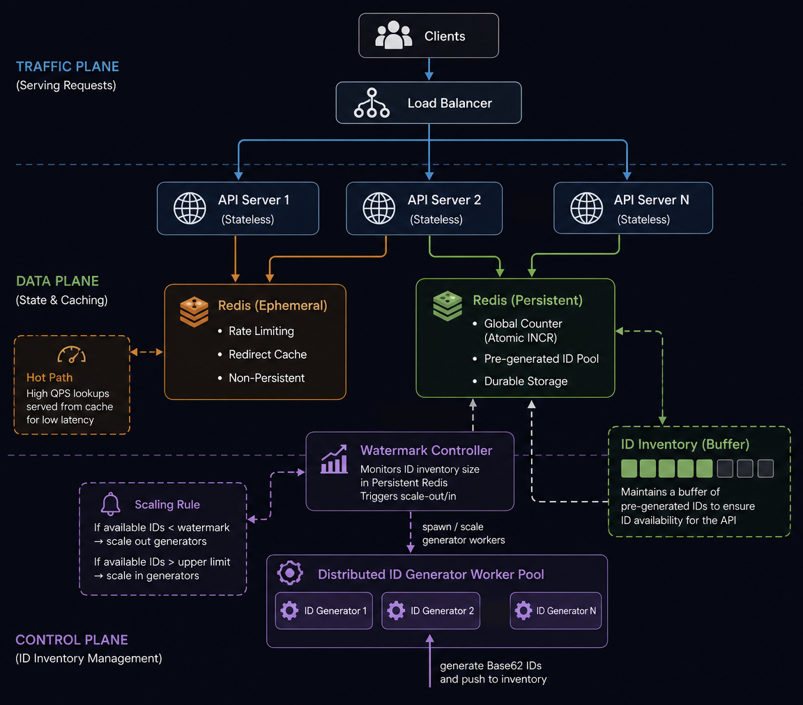
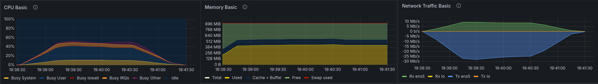
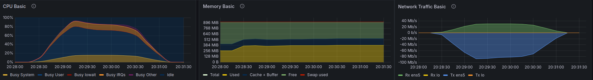
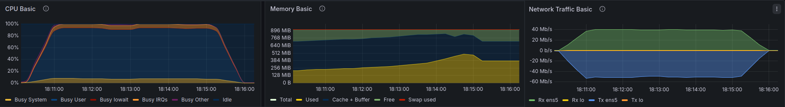

# Distributed URL Shortener

A horizontally scalable URL shortening service designed to handle high-volume redirection requests with minimal latency. Built as a practical exploration of distributed systems concepts including distributed ID generation, multi-tier caching, concurrent request handling, and scalable redirect resolution.

## System Design Objectives

* **Low-Latency Redirects:** Optimized the lookup path to ensure that URL resolution and 302 redirection are handled with minimal CPU and memory overhead.

* **Horizontal Scalability:** The service is entirely stateless, allowing instances to be added or removed behind a load balancer without impacting system integrity.

* **Layered Caching:** Implemented a **dual-layer L1 (Local) and L2 (Redis) caching strategy** to serve frequent requests. This reduces primary database load and speed up lookups for frequently accessed links.

* **Concurrency Handling:** Leveraged Go’s native concurrency primitives (goroutines and channels) to manage high-frequency request patterns efficiently.


## Engineering Focus

1. **Unique ID Generation:** Implemented a distributed ID reservation system using Redis INCR to pre-allocate sequences. This ensures collision-free code generation across multiple nodes while minimizing the overhead of a centralized lock for every request.

2. **Data Immutability:** Designed the system with an immutable data model. Once a short link is generated, it is never modified, eliminating the need for cache invalidation logic and ensuring high cache hit rates.

4. **Graceful Shutdown:** Implemented signal handling to ensure the service completes in-flight requests before a node terminates. The shutdown routine specifically flushes any buffered, pre-allocated ID sequences back to the **centralized Redis store** to prevent ID exhaustion and ensure clean state transitions during scaling events.

---

## High-Level Design



---

## Performance Benchmarking & Stress Testing

### Deployment Infrastructure

The testing environment was designed to isolate the web server's logic from the state-management overhead. This allowed for a clear view of how the Go application handles high-concurrency traffic in isolation.

**Hardware & OS**

* **Compute:** 2x AWS `t3.micro` instances (**2 vCPU, 1GB RAM**).
* **OS:** Ubuntu 22.04 LTS.

**Environment Structure**

1. **Application Node:** Dedicated exclusively to the Go web server and the local L1 cache. This was the primary target for all stress tests.

2. **Infrastructure Node:** A standalone instance hosting the **Redis** ecosystem, which served three critical roles:

* **L2 Cache:** Distributed "warm" storage for redirect mappings.
* **Atomic ID Generator:** Coordinating unique ID sequences across the system.
* **Rate Limiter:** Managing request throttling to prevent service abuse.

3. **Persistence Layer:**  **AWS DynamoDB** was utilized for long-term storage, ensuring the persistent data layer scaled independently of the compute instances.

### Execution & Load Analysis

To determine the service's operational limits, I conducted a series of stress tests using **k6** . The goal was to identify the exact threshold where resource contention—specifically CPU context switching and network interrupt handling—began to impact the user experience.

[View Stress Test Script](./scripts/load-test/)

***1. The "Optimal" Zone (Steady State)***

This test represents the ideal operating conditions where the system handles traffic with significant headroom.

* **Throughput:** 3,000 RPS
* **Median Latency:** 0.7ms
* **P95 Latency:** 4.3ms
* **CPU Usage:** ~50%

>  **Analysis:** At this scale, the L1/L2 cache layers handle nearly all traffic. The sub-millisecond median proves the efficiency of Go's `net/http` stack and the LRU cache.


*Caption: Grafana showing stable 3k RPS with 50% CPU headroom.*

***2. The "Saturation" Point (Mechanical Limit)***

I pushed the rate to 15,000 RPS to find the system's "ceiling." The server reached a maximum sustained throughput of **11,600 RPS**.

* **Peak Throughput:** 11,599.8 RPS
* **Median Latency:** 85.03ms
* **P95 Latency:** 325.27ms
* **Resource Bottleneck:** CPU Saturation / Network I/O

>  **Analysis:** At **11.6k RPS**, the system reached its mechanical limit. The jump in latency is a direct result of CPU saturation on the `t3.micro` instance, specifically due to the overhead of high-frequency network interrupts and context switching. Despite the hardware hitting 100% utilization, the service maintained **zero socket errors**, proving the stability of the Go runtime under maximum load.


*Caption: The moment we hit 11.6k RPS. The server is at max capacity but still running smoothly.*

***3. Write-Path Persistence Stress***

A separate test was conducted focusing on link creation (`POST` requests) to measure database and hashing overhead.

* **Throughput:** 1,550 RPS
* **Median Latency:** 629ms
* **P95 Latency:** 2.34s
* **Success Rate:** 100%

>  **Analysis:** During this test, the application node hit **100% CPU utilization**, primarily driven by **I/O wait and kernel overhead**. Since the application skips hashing/collision checks by using pre-generated IDs, the latency is almost entirely down to **DynamoDB burst write limits** and the overhead of managing thousands of concurrent outgoing HTTPS connections. Despite the high I/O pressure, the server remained 100% stable without a single failed write.


*Caption: Full CPU saturation during write stress. The high "I/O Wait" levels indicate the CPU is bottlenecked by the time it takes to commit data to the remote database.*


### **Engineering Challenges: The 20k RPS Wall**

During initial testing, I attempted to push the service to **20,000 RPS**. This triggered an immediate system failure where the **Linux OOM (Out of Memory) Killer** terminated the application process.

* **The Diagnosis:** Monitoring confirmed that the Go process memory usage spiked until it exhausted the 1GB RAM limit. At this extreme concurrency, the memory overhead—likely from the massive number of active goroutines and their stacks—outpaced the garbage collector's ability to reclaim memory.

* **The Fix:** I tuned the **Virtual User (VU)** count to find the right balance between concurrency and memory consumption. By capping the number of VUs to a level the 1GB instance could actually handle, I prevented the "goroutine explosion" that was previously bloating the process memory and triggering the OOM killer.

* **The Result:** By controlling the concurrency more granularly, I was able to identify **11.6k RPS** as the stable mechanical ceiling where the system remains 100% reliable without triggering memory exhaustion.

---


## API Reference

### Create Short URL

**Request**

```http
POST /api/short
Content-Type: application/json
{
	"longurl": "https://example.com"
}
```

**Response**

```json
{
	"redirect_id": "abc123"
}
```

### Redirect

**Request**
```http
GET /abc123
```

**Response**
```http
302 Found
Location: https://example.com
```

---

## Future Roadmap

1. **Asynchronous Write-Path (Message Queues):**
Integrate a message queue (e.g., **RabbitMQ** or **AWS SQS**) to handle link creation. This would decouple the HTTP response from the DynamoDB write, drastically reducing write-path latency and protecting the database from traffic spikes.

2. **High-Availability State Management (Redis Cluster):**
Transition from a single-node Redis instance to a **Redis Cluster**. This ensures that both the L2 cache and the **Global Counter / ID Pool** are sharded and replicated, removing the single point of failure for link generation.

3. **Edge Caching (CDN Integration):**
Deploy a **CDN (CloudFront/Cloudflare)** to cache the most popular redirects at edge locations. This would bring redirect latencies down to sub-10ms for users worldwide by bypassing the application server entirely for "hot" links.

4. ****Multi-Tenant Analytics:****
Implement an account system to enable **per-link analytics** (click counts, geographic data) via a non-blocking background pipeline (e.g., Kinesis to S3).


